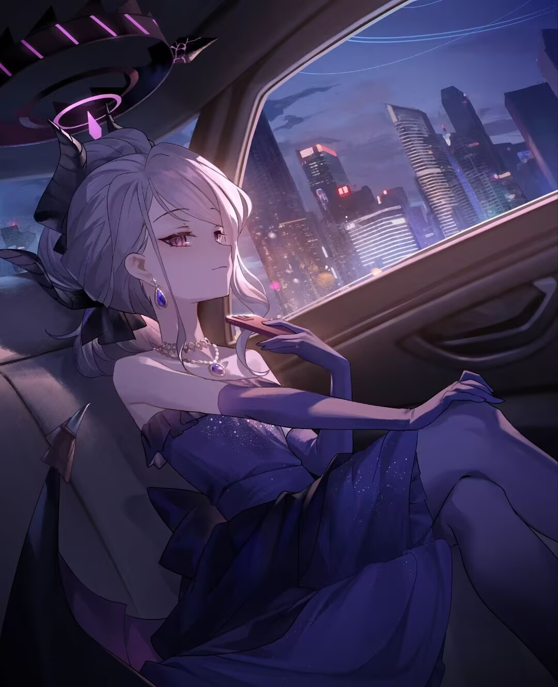



  
<!-- thanks for:https://github.com/NolanHo/NolanHo -->
> 
<em>
>      
>     我们凝望着最初的凝望，感到另一颗心跨越时空，望见生命的力量之和。
>      
>     We gaze upon the first gaze,feeling another heart transcend time and space,
>      
>     seeing the sum of the power of life.
> </em>

> 

>     &mdash;&mdash;&mdash;《National Treasure》
> 

<!-- ## About Me
 -->

_✨  Being keen on steering practical things, now hands-on **FE** and **BE**.  ✨_

_Though worldly affairs shift like fleeting clouds and life ultimately withers, the striving for eternity and brilliance amidst impermanence remains preserved in our cultural memory._

_Contributor and Plugin Developer of **[@AstrBotDevs/AstrBot](https://github.com/AstrBotDevs/AstrBot)**_

<em>Nice to meet you! May every day be filled with sunshine and smiles for you.★</em>

