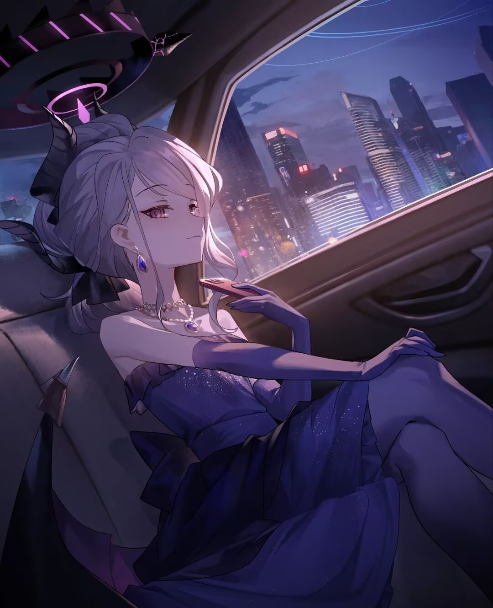



  
<!-- thanks for:https://github.com/NolanHo/NolanHo -->
> 
<em>
>      
>     我喜欢晚上，如果没有晚上，我们永远看不到星星
>      
>     I like the night.
>      
>     Without the dark, we'd never see the stars.
> </em>

> 

>     &mdash;&mdash;&mdash;《Twilight》
> 

<!-- ## About Me
 -->

_✨  Being keen on steering practical things, now hands-on **FE** and **BE**.  ✨_

_Though worldly affairs shift like fleeting clouds and life ultimately withers, the striving for eternity and brilliance amidst impermanence remains preserved in our cultural memory._

